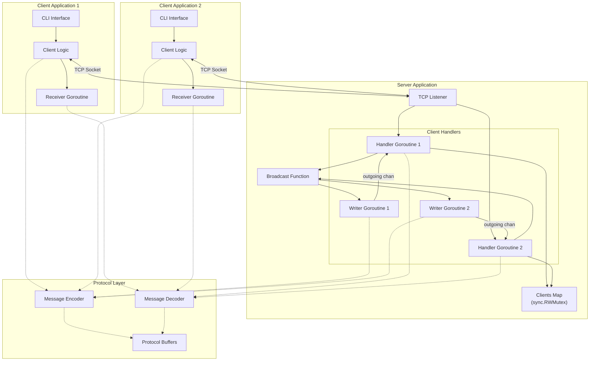
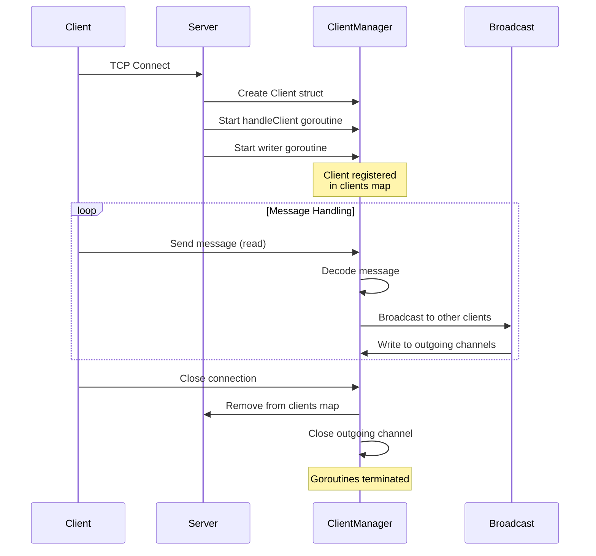
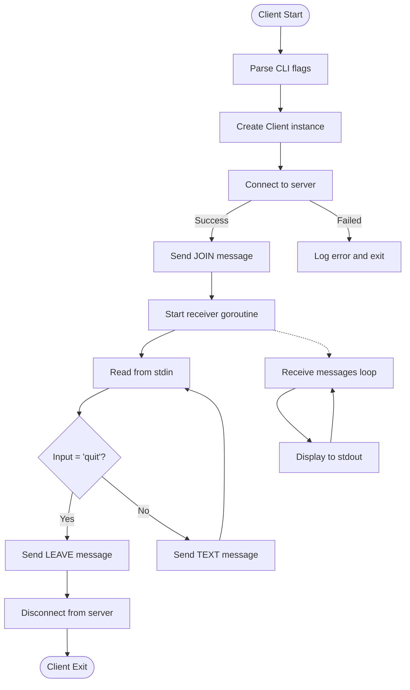
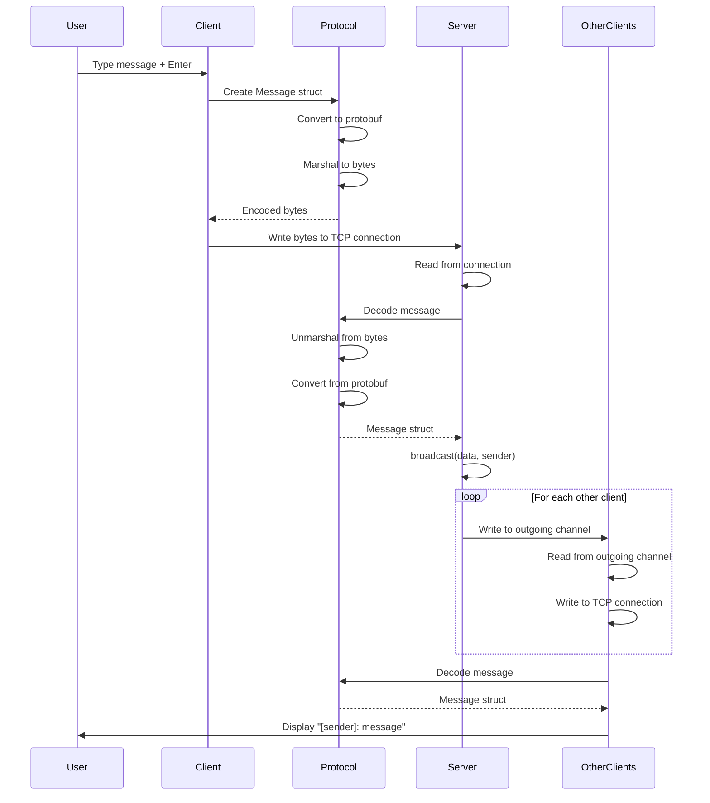
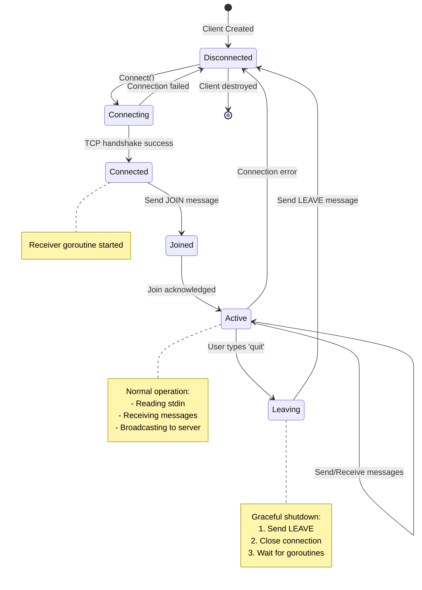

# Architecture

This document describes the technical architecture of the TCP Socket Chat system.

## Overview

The system consists of three main components:

1. **Message Protocol** (`pkg/protocol`) - Defines message format and encoding
2. **Server** (`internal/server`) - Manages connections and broadcasts messages
3. **Client** (`internal/client`) - Connects to server and handles user interaction

## System Architecture



## Component Details

### Message Protocol (`pkg/protocol`)

The protocol package defines the message structure and encoding/decoding logic.

#### Message Structure

```go
type Message struct {
    Type    MessageType
    Sender  string
    Content string
}
```

#### Message Types

```go
const (
    MessageTypeText  MessageType = iota  // Regular chat message
    MessageTypeJoin                      // User joined notification
    MessageTypeLeave                     // User left notification
)
```

#### Encoding

Messages are encoded using Protocol Buffers (protobuf), which provides:
- Efficient binary encoding
- Cross-language compatibility
- Explicit schema definition
- Backward/forward compatibility support

#### Protocol Buffer Schema

The message schema is defined in `proto/message.proto`:

```protobuf
enum MessageType {
  MESSAGE_TYPE_TEXT = 0;
  MESSAGE_TYPE_JOIN = 1;
  MESSAGE_TYPE_LEAVE = 2;
}

message Message {
  MessageType type = 1;
  string sender = 2;
  string content = 3;
}
```

#### Code Generation

Protobuf code is auto-generated from the schema:

```bash
# Using devbox
devbox run generate:proto
```

Generated code is committed to the repository (`pkg/protocol/pb/message.pb.go`) to ensure reproducible builds.

#### Implementation Details

The public API (`Message.Encode()` and `Message.Decode()`) remains unchanged. Protobuf is used internally through a conversion layer:

```go
// Internal conversion functions
func (m *Message) toProto() *pb.Message
func (m *Message) fromProto(pbMsg *pb.Message)
```

This design:
- Isolates protobuf implementation details from the public API
- Maintains backward compatibility with existing code
- Allows future encoding changes without breaking the API

We chose Protocol Buffers because:
- Cross-language interoperability (could support non-Go clients)
- Explicit schema definition makes the protocol clear and versioned
- Better tooling support and ecosystem
- Efficient binary format with smaller message sizes
- Built-in support for schema evolution

### Server (`internal/server`)

The server manages client connections and broadcasts messages.

#### Core Components

```go
type Server struct {
    address  string                  // Listen address (e.g., ":8080")
    listener net.Listener            // TCP listener
    clients  map[*Client]bool        // Connected clients
    mu       sync.RWMutex            // Protects clients map
    quit     chan struct{}           // Shutdown signal
    wg       sync.WaitGroup          // Goroutine coordination
}

type Client struct {
    conn     net.Conn                // TCP connection
    username string                  // User's name
    outgoing chan []byte             // Outgoing message queue
}
```

#### Connection Flow



#### Concurrency Model

The server uses a concurrent model with the following characteristics:

Each client connection uses two dedicated goroutines:
- One goroutine reads messages from the client
- Another goroutine writes messages to the client
- This separation allows independent read/write operations
- It prevents blocking when a client is slow

For synchronization:
```go
mu sync.RWMutex  // Protects clients map
- Read lock: For broadcasting (reading the map)
- Write lock: For adding/removing clients (modifying the map)
```

The message queue is implemented as a buffered channel:
```go
outgoing chan []byte  // Buffered channel (size: 10)
```
- This decouples receiving messages from sending them
- It prevents blocking when clients are slow
- Messages are dropped if the queue fills up

For graceful shutdown, the server uses:
```go
quit chan struct{}   // Broadcast shutdown signal
wg sync.WaitGroup    // Wait for all goroutines
```

#### Thread Safety

All shared resources are protected:

1. **Clients Map**
   - Protected by `sync.RWMutex`
   - Multiple readers OR single writer
   - Prevents concurrent map access panics

2. **Client Channels**
   - Closed only after client is removed from map
   - Prevents sending to closed channels

3. **Connection State**
   - Each connection owned by one goroutine
   - No shared state between goroutines

### Client (`internal/client`)

The client connects to the server and manages message exchange.

#### Core Components

```go
type Client struct {
    address  string                  // Server address
    username string                  // User's name
    conn     net.Conn                // TCP connection
    messages chan protocol.Message   // Incoming messages
    mu       sync.RWMutex            // Protects conn
    done     chan struct{}           // Shutdown signal
    wg       sync.WaitGroup          // Goroutine coordination
}
```

#### Operation Flow



#### Concurrency Model

A background receiver goroutine handles incoming messages:
- It continuously reads from the TCP connection
- Decodes messages and sends them to the `messages` channel
- The application reads from the channel when ready

For thread safety:
```go
mu sync.RWMutex  // Protects connection access
```
- This mutex is used when checking connection state
- It prevents concurrent access to the connection

## Data Flow

### Sending a Message



### Connection Lifecycle



## Error Handling

### Server Errors

1. **Accept Errors**
   - Log error and continue accepting
   - Check for shutdown signal

2. **Read Errors**
   - Treat as client disconnect
   - Clean up client resources
   - Don't crash server

3. **Broadcast Errors**
   - Skip failed client
   - Log error
   - Continue broadcasting to others

### Client Errors

1. **Connection Errors**
   - Return error to caller
   - Don't start receiver goroutine

2. **Read Errors**
   - Log error
   - Exit receiver goroutine
   - Application should detect disconnect

3. **Send Errors**
   - Return error to caller
   - Let application handle

## Performance Considerations

### Buffering

The client outgoing channel is buffered with a capacity of 10 messages. This prevents blocking when clients are slow, though messages may be dropped if a client becomes very slow.

TCP connections use OS-level buffering, with no explicit buffering added at the application level.

### Scalability

Current limitations:
- Single-threaded broadcast (sequentially sends to each client)
- All clients in memory
- No message persistence

For production scale:
- Use pub/sub system (Redis, NATS)
- Horizontal scaling with load balancer
- Separate connection handling from message routing

### Memory Usage

Per client:
- Connection object: ~1KB
- Goroutines: ~4KB each (2 per client)
- Message buffer: ~1KB (channel buffer)

Estimated: ~10KB per connected client

## Design Decisions

### Why Two Goroutines Per Client?

We considered using a single goroutine for both reading and writing, but this creates problems: blocking on write prevents reading, and blocking on read prevents writing.

Another option was non-blocking I/O with select statements, but this leads to more complex code that's less idiomatic in Go and harder to maintain.

We chose separate goroutines because they provide simple, idiomatic Go code where each goroutine has a single responsibility and the flow is easy to reason about.

### Why Mutex Instead of Channels for Clients Map?

We could have used channels to serialize access to the clients map:
```go
type clientOp struct {
    op      string
    client  *Client
    result  chan bool
}
```

Channels are more idiomatic and prevent forgetting to lock, but mutexes are simpler with less overhead and more straightforward code.

We chose a mutex because it makes the intent clearer (protecting a data structure), requires less boilerplate code, and offers better performance for our read-heavy workload.

### Why Protocol Buffers?

See "Encoding" section above for detailed rationale.

## Future Improvements

### Short Term
1. Add connection timeout handling
2. Implement heartbeat/ping messages
3. Add message size limits
4. Better error recovery

### Long Term
1. Support for private messages
2. Chat rooms/channels
3. Message history persistence
4. Authentication and authorization
5. TLS encryption
6. Rate limiting
7. Message acknowledgments

## References

- Go Concurrency Patterns: https://go.dev/blog/pipelines
- Effective Go: https://go.dev/doc/effective_go
- TCP Socket Programming: https://pkg.go.dev/net
