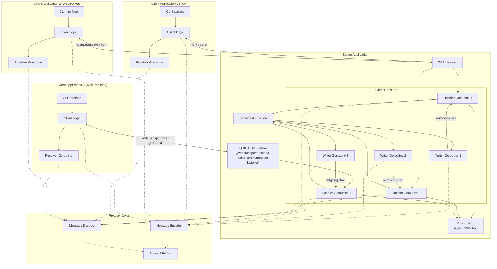
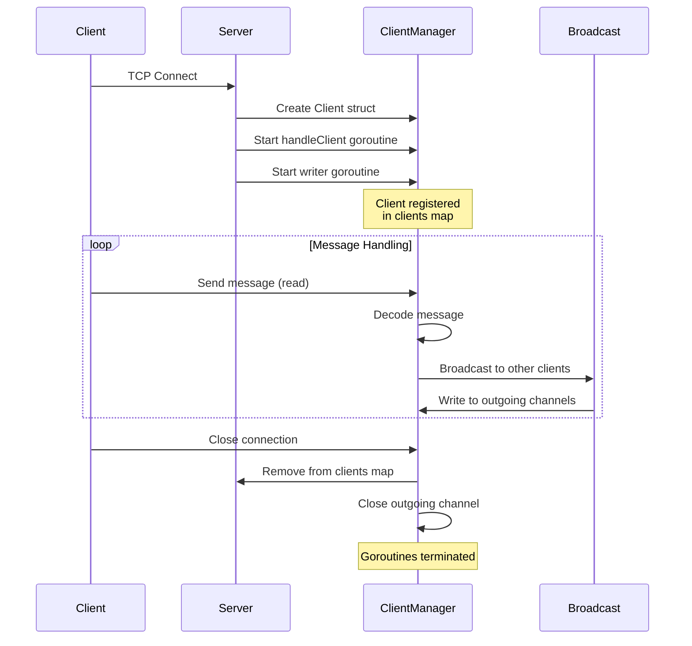
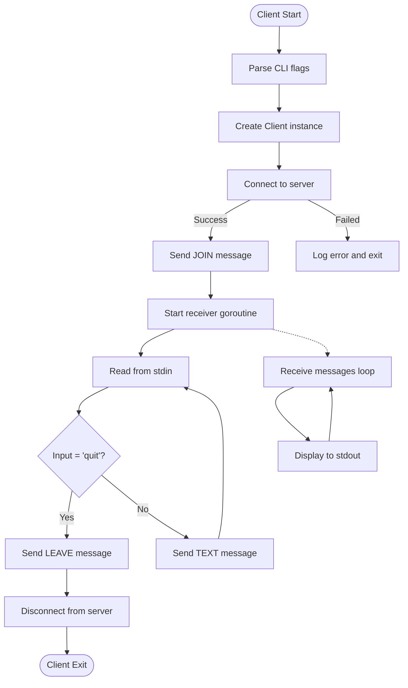
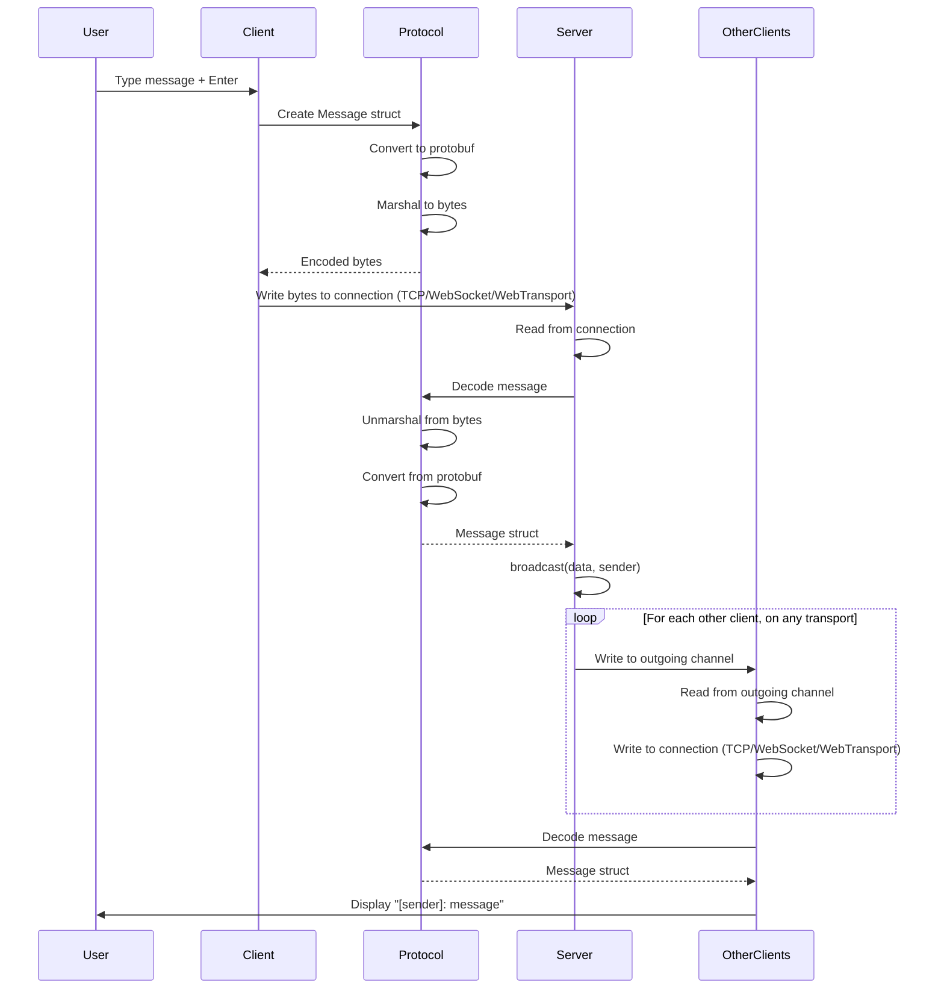
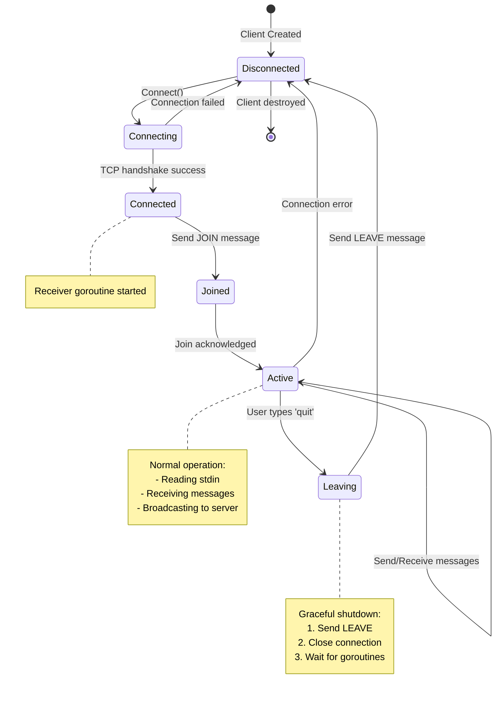

# Architecture

This document describes the technical architecture of the TCP Socket Chat system.

## Overview

The system consists of three main components:

1. **Message Protocol** (`pkg/protocol`) - Defines message format and encoding
2. **Server** (`internal/server`) - Manages connections and broadcasts messages
3. **Client** (`internal/client`) - Connects to server and handles user interaction

The server accepts three transports: raw TCP, WebSocket, and WebTransport (HTTP/3 over QUIC). TCP and WebSocket share a single TCP listener, distinguished by peeking at the first bytes of each connection. WebTransport runs over UDP and is served from a second, optional listener bound to the same port number; it is only started when the server is given a TLS certificate. Clients on any of the three transports are added to the same client set, so messages broadcast across all of them.

## System Architecture


```mermaid
flowchart TB
    subgraph ClientApp1["Client Application 1 (TCP)"]
        CLI1[CLI Interface]
        ClientLogic1[Client Logic]
        Receiver1[Receiver Goroutine]
    end

    subgraph ClientApp2["Client Application 2 (WebSocket)"]
        CLI2[CLI Interface]
        ClientLogic2[Client Logic]
        Receiver2[Receiver Goroutine]
    end

    subgraph ClientApp3["Client Application 3 (WebTransport)"]
        CLI3[CLI Interface]
        ClientLogic3[Client Logic]
        Receiver3[Receiver Goroutine]
    end

    subgraph ServerApp["Server Application"]
        Listener[TCP Listener]
        QUICListener["QUIC/UDP Listener<br/>(WebTransport, optional,<br/>same port number as Listener)"]
        subgraph ClientHandlers["Client Handlers"]
            Handler1[Handler Goroutine 1]
            Handler2[Handler Goroutine 2]
            Handler3[Handler Goroutine 3]
            Writer1[Writer Goroutine 1]
            Writer2[Writer Goroutine 2]
            Writer3[Writer Goroutine 3]
        end
        ClientsMap["Clients Map<br/>(sync.RWMutex)"]
        Broadcaster[Broadcast Function]
    end

    subgraph Protocol["Protocol Layer"]
        Encoder[Message Encoder]
        Decoder[Message Decoder]
        Protobuf[Protocol Buffers]
    end

    CLI1 --> ClientLogic1
    CLI2 --> ClientLogic2
    CLI3 --> ClientLogic3
    ClientLogic1 <-->|TCP Socket| Listener
    ClientLogic2 <-->|WebSocket over TCP| Listener
    ClientLogic3 <-->|WebTransport over QUIC/UDP| QUICListener
    ClientLogic1 --> Receiver1
    ClientLogic2 --> Receiver2
    ClientLogic3 --> Receiver3

    Listener --> Handler1
    Listener --> Handler2
    QUICListener --> Handler3
    Handler1 --> ClientsMap
    Handler2 --> ClientsMap
    Handler3 --> ClientsMap
    Handler1 --> Broadcaster
    Handler2 --> Broadcaster
    Handler3 --> Broadcaster
    Broadcaster --> Writer1
    Broadcaster --> Writer2
    Broadcaster --> Writer3
    Writer1 -->|outgoing chan| Handler1
    Writer2 -->|outgoing chan| Handler2
    Writer3 -->|outgoing chan| Handler3

    ClientLogic1 -.-> Encoder
    ClientLogic2 -.-> Encoder
    ClientLogic3 -.-> Encoder
    Receiver1 -.-> Decoder
    Receiver2 -.-> Decoder
    Receiver3 -.-> Decoder
    Handler1 -.-> Decoder
    Handler2 -.-> Decoder
    Handler3 -.-> Decoder
    Writer1 -.-> Encoder
    Writer2 -.-> Encoder
    Writer3 -.-> Encoder

    Encoder -.-> Protobuf
    Decoder -.-> Protobuf
```

Note: all three transports funnel into the same `register`/`handleClient` machinery in `internal/server/server.go`; the diagram shows one handler/writer pair per client application only to illustrate that each connection, regardless of transport, gets its own goroutine pair and is added to the same `ClientsMap`.

## Component Details

### Message Protocol (`pkg/protocol`)

The protocol package defines the message structure and encoding/decoding logic.

#### Message Structure

```go
type Message struct {
    Type    MessageType
    Sender  string
    Content string
}
```

#### Message Types

```go
const (
    MessageTypeText  MessageType = iota  // Regular chat message
    MessageTypeJoin                      // User joined notification
    MessageTypeLeave                     // User left notification
)
```

#### Encoding

Messages are encoded using Protocol Buffers (protobuf), which provides:
- Efficient binary encoding
- Cross-language compatibility
- Explicit schema definition
- Backward/forward compatibility support

#### Protocol Buffer Schema

The message schema is defined in `proto/message.proto`:

```protobuf
enum MessageType {
  MESSAGE_TYPE_TEXT = 0;
  MESSAGE_TYPE_JOIN = 1;
  MESSAGE_TYPE_LEAVE = 2;
}

message Message {
  MessageType type = 1;
  string sender = 2;
  string content = 3;
}
```

#### Code Generation

Protobuf code is auto-generated from the schema:

```bash
# Using devbox
devbox run generate:proto
```

Generated code is committed to the repository (`pkg/protocol/pb/message.pb.go`) to ensure reproducible builds.

#### Implementation Details

The public API (`Message.Encode()` and `Message.Decode()`) remains unchanged. Protobuf is used internally through a conversion layer:

```go
// Internal conversion functions
func (m *Message) toProto() *pb.Message
func (m *Message) fromProto(pbMsg *pb.Message)
```

This design:
- Isolates protobuf implementation details from the public API
- Maintains backward compatibility with existing code
- Allows future encoding changes without breaking the API

We chose Protocol Buffers because:
- Cross-language interoperability (could support non-Go clients)
- Explicit schema definition makes the protocol clear and versioned
- Better tooling support and ecosystem
- Efficient binary format with smaller message sizes
- Built-in support for schema evolution

### Server (`internal/server`)

The server manages client connections and broadcasts messages.

#### Core Components

```go
type Server struct {
    address  string                  // Listen address (e.g., ":8080")
    listener net.Listener            // TCP listener
    clients  map[*Client]bool        // Connected clients
    mu       sync.RWMutex            // Protects clients map
    quit     chan struct{}           // Shutdown signal
    wg       sync.WaitGroup          // Goroutine coordination

    tlsCert  *tls.Certificate        // Set via WithTLS; enables WebTransport
    wtServer *webtransport.Server    // Non-nil only when tlsCert is set
}

type Client struct {
    conn     Connection              // TCP, WebSocket, or WebTransport connection
    username string                  // User's name
    outgoing chan []byte             // Outgoing message queue
}
```

#### Connection Abstraction

`Client.conn` is a `Connection` interface (`internal/server/connection.go`) rather than a concrete `net.Conn`, so `handleClient` and `broadcast` work identically regardless of which transport a client used to connect:

```go
type Connection interface {
    RemoteAddr() net.Addr
    Write(data []byte) (int, error)
    Read(buf []byte) (int, error)
    Close() error
    SetReadDeadline(t time.Time) error
}
```

Three implementations exist:
- **`TCPConnection`** (`connection.go`) - wraps a raw `net.Conn`. When protocol detection has already peeked bytes off the socket, `NewTCPConnectionWithReader` preserves the buffered reader so no data is lost.
- **`WebSocketConnection`** (`connection.go`) - wraps a `net.Conn` and frames reads/writes as WebSocket binary messages using `gobwas/ws`/`wsutil`.
- **`WebTransportConnection`** (`webtransport.go`) - wraps a `webtransport.Session` and the single bidirectional `webtransport.Stream` opened for the session, treating it as an unframed byte stream with the same one-Read-per-message assumption as `TCPConnection`. `Close` tears down both the stream and the session so the underlying QUIC connection is released.

Both TCP and WebSocket connections are accepted from the same `net.Listener`; `detectProtocol` (`protocol.go`) peeks at the first bytes of each accepted connection to tell them apart (see [Protocol Detection](#protocol-detection) below). WebTransport, being UDP-based, cannot be multiplexed onto that listener and is instead served from a second, independent listener (see [WebTransport](#webtransport-internalserverwebtransportgo) below).

#### Protocol Detection

`detectProtocol` peeks at the first 4 bytes of each newly accepted TCP connection without consuming them, so the same byte stream can still be handed to whichever `Connection` implementation is chosen:

- Bytes matching an HTTP request line (`GET `, `POST`, `PUT `, `HEAD`) are treated as a WebSocket upgrade request (`protocolHTTP`), and `upgradeWebSocket` completes the handshake before wrapping the connection in a `WebSocketConnection`.
- Anything else is treated as a raw protobuf-framed TCP connection (`protocolTCP`) and wrapped in a `TCPConnection`.

This peeking approach only works because both protocols share one TCP byte stream; it does not extend to WebTransport, which arrives over separate UDP packets.

#### WebTransport (`internal/server/webtransport.go`)

When the server is started with a TLS certificate (`WithTLS`), `Start` calls `startWebTransport` after the TCP listener is bound. It derives the UDP port from the TCP listener's bound address (rather than from the configured address string) so that a wildcard port (`:0`) resolves to the same concrete port on both listeners, and starts an `http3.Server` wrapped in a `webtransport.Server` on that UDP port in a background goroutine.

Each incoming WebTransport session is upgraded from an HTTP/3 request in `handleWebTransport`, which then accepts the single bidirectional stream the client opens and wraps `(session, stream)` in a `WebTransportConnection`. That connection is passed to the same `register` function used by TCP and WebSocket connections, so a WebTransport client becomes an ordinary `Client` in `clients` and participates in `broadcast` like any other.

#### Connection Flow


```mermaid
sequenceDiagram
    participant Client
    participant Server
    participant ClientManager
    participant Broadcast

    Client->>Server: TCP Connect
    Server->>ClientManager: Create Client struct
    Server->>ClientManager: Start handleClient goroutine
    Server->>ClientManager: Start writer goroutine

    Note over ClientManager: Client registered<br/>in clients map

    loop Message Handling
        Client->>ClientManager: Send message (read)
        ClientManager->>ClientManager: Decode message
        ClientManager->>Broadcast: Broadcast to other clients
        Broadcast->>ClientManager: Write to outgoing channels
    end

    Client->>ClientManager: Close connection
    ClientManager->>Server: Remove from clients map
    ClientManager->>ClientManager: Close outgoing channel
    Note over ClientManager: Goroutines terminated
```

#### Concurrency Model

The server uses a concurrent model with the following characteristics:

Each client connection uses two dedicated goroutines:
- One goroutine reads messages from the client
- Another goroutine writes messages to the client
- This separation allows independent read/write operations
- It prevents blocking when a client is slow

For synchronization:
```go
mu sync.RWMutex  // Protects clients map
- Read lock: For broadcasting (reading the map)
- Write lock: For adding/removing clients (modifying the map)
```

The message queue is implemented as a buffered channel:
```go
outgoing chan []byte  // Buffered channel (size: 10)
```
- This decouples receiving messages from sending them
- It prevents blocking when clients are slow
- Messages are dropped if the queue fills up

For graceful shutdown, the server uses:
```go
quit chan struct{}   // Broadcast shutdown signal
wg sync.WaitGroup    // Wait for all goroutines
```

#### Thread Safety

All shared resources are protected:

1. **Clients Map**
   - Protected by `sync.RWMutex`
   - Multiple readers OR single writer
   - Prevents concurrent map access panics

2. **Client Channels**
   - Closed only after client is removed from map
   - Prevents sending to closed channels

3. **Connection State**
   - Each connection owned by one goroutine
   - No shared state between goroutines

### Client (`internal/client`)

The client connects to the server and manages message exchange.

#### Core Components

```go
type Client struct {
    address  string                  // Server address
    username string                  // User's name
    protocol string                  // "tcp", "ws", or "wt"
    rootCAs  *x509.CertPool          // Optional; TLS trust for "wt"
    conn     ClientConnection        // TCP, WebSocket, or WebTransport connection
    messages chan protocol.Message   // Incoming messages
    mu       sync.RWMutex            // Protects conn
    done     chan struct{}           // Shutdown signal
    wg       sync.WaitGroup          // Goroutine coordination
}
```

Like the server, `Client.conn` is a `ClientConnection` interface (`internal/client/connection.go`) with one implementation per transport: `TCPClientConnection`, `WebSocketClientConnection`, and `WebTransportClientConnection`. `Connect` dispatches on `protocol` to build the right one; `WebTransportClientConnection` wraps a `webtransport.Session` plus the single bidirectional stream opened with `OpenStreamSync`, mirroring `WebTransportConnection` on the server. `rootCAs`, set via `WithRootCAs`, is passed as the WebTransport dialer's `TLSClientConfig.RootCAs`; a nil pool falls back to the system trust store, which is why it is only meaningful for `wt` (`-ca` is ignored for `tcp`/`ws` in `cmd/client/main.go`).

#### Operation Flow


```mermaid
flowchart TD
    Start([Client Start]) --> Parse[Parse CLI flags]
    Parse --> Create[Create Client instance]
    Create --> Connect[Connect to server]
    Connect -->|Success| Join[Send JOIN message]
    Connect -->|Failed| Error[Log error and exit]

    Join --> StartReceiver[Start receiver goroutine]
    StartReceiver --> ReadInput[Read from stdin]

    ReadInput --> CheckQuit{Input = 'quit'?}
    CheckQuit -->|Yes| Leave[Send LEAVE message]
    CheckQuit -->|No| Send[Send TEXT message]

    Send --> ReadInput
    Leave --> Disconnect[Disconnect from server]
    Disconnect --> End([Client Exit])

    StartReceiver -.-> ReceiveLoop[Receive messages loop]
    ReceiveLoop --> Display[Display to stdout]
    Display --> ReceiveLoop
```

#### Concurrency Model

A background receiver goroutine handles incoming messages:
- It continuously reads from the underlying connection (TCP, WebSocket, or WebTransport)
- Decodes messages and sends them to the `messages` channel
- The application reads from the channel when ready

For thread safety:
```go
mu sync.RWMutex  // Protects connection access
```
- This mutex is used when checking connection state
- It prevents concurrent access to the connection

## Data Flow

### Sending a Message


```mermaid
sequenceDiagram
    participant User
    participant Client
    participant Protocol
    participant Server
    participant OtherClients

    User->>Client: Type message + Enter
    Client->>Protocol: Create Message struct
    Protocol->>Protocol: Convert to protobuf
    Protocol->>Protocol: Marshal to bytes
    Protocol-->>Client: Encoded bytes

    Client->>Server: Write bytes to connection (TCP/WebSocket/WebTransport)
    Server->>Server: Read from connection
    Server->>Protocol: Decode message
    Protocol->>Protocol: Unmarshal from bytes
    Protocol->>Protocol: Convert from protobuf
    Protocol-->>Server: Message struct

    Server->>Server: broadcast(data, sender)

    loop For each other client, on any transport
        Server->>OtherClients: Write to outgoing channel
        OtherClients->>OtherClients: Read from outgoing channel
        OtherClients->>OtherClients: Write to connection (TCP/WebSocket/WebTransport)
    end

    OtherClients->>Protocol: Decode message
    Protocol-->>OtherClients: Message struct
    OtherClients->>User: Display "[sender]: message"
```

### Connection Lifecycle


```mermaid
stateDiagram-v2
    [*] --> Disconnected: Client Created

    Disconnected --> Connecting: Connect()
    Connecting --> Connected: TCP handshake success
    Connecting --> Disconnected: Connection failed

    Connected --> Joined: Send JOIN message
    Joined --> Active: Join acknowledged

    Active --> Active: Send/Receive messages
    Active --> Leaving: User types 'quit'
    Active --> Disconnected: Connection error

    Leaving --> Disconnected: Send LEAVE message
    Disconnected --> [*]: Client destroyed

    note right of Connected
        Receiver goroutine started
    end note

    note right of Active
        Normal operation:
        - Reading stdin
        - Receiving messages
        - Broadcasting to server
    end note

    note right of Leaving
        Graceful shutdown:
        1. Send LEAVE
        2. Close connection
        3. Wait for goroutines
    end note
```

## Error Handling

### Server Errors

1. **Accept Errors**
   - Log error and continue accepting
   - Check for shutdown signal

2. **Read Errors**
   - Treat as client disconnect
   - Clean up client resources
   - Don't crash server

3. **Broadcast Errors**
   - Skip failed client
   - Log error
   - Continue broadcasting to others

### Client Errors

1. **Connection Errors**
   - Return error to caller
   - Don't start receiver goroutine

2. **Read Errors**
   - Log error
   - Exit receiver goroutine
   - Application should detect disconnect

3. **Send Errors**
   - Return error to caller
   - Let application handle

## Performance Considerations

### Buffering

The client outgoing channel is buffered with a capacity of 10 messages. This prevents blocking when clients are slow, though messages may be dropped if a client becomes very slow.

TCP connections use OS-level buffering, with no explicit buffering added at the application level.

### Scalability

Current limitations:
- Single-threaded broadcast (sequentially sends to each client)
- All clients in memory
- No message persistence

For production scale:
- Use pub/sub system (Redis, NATS)
- Horizontal scaling with load balancer
- Separate connection handling from message routing

### Memory Usage

Per client:
- Connection object: ~1KB
- Goroutines: ~4KB each (2 per client)
- Message buffer: ~1KB (channel buffer)

Estimated: ~10KB per connected client

## Design Decisions

### Why Two Goroutines Per Client?

We considered using a single goroutine for both reading and writing, but this creates problems: blocking on write prevents reading, and blocking on read prevents writing.

Another option was non-blocking I/O with select statements, but this leads to more complex code that's less idiomatic in Go and harder to maintain.

We chose separate goroutines because they provide simple, idiomatic Go code where each goroutine has a single responsibility and the flow is easy to reason about.

### Why Mutex Instead of Channels for Clients Map?

We could have used channels to serialize access to the clients map:
```go
type clientOp struct {
    op      string
    client  *Client
    result  chan bool
}
```

Channels are more idiomatic and prevent forgetting to lock, but mutexes are simpler with less overhead and more straightforward code.

We chose a mutex because it makes the intent clearer (protecting a data structure), requires less boilerplate code, and offers better performance for our read-heavy workload.

### Why Protocol Buffers?

See "Encoding" section above for detailed rationale.

### Why a Second Listener for WebTransport?

TCP and WebSocket share one `net.Listener` because `detectProtocol` can peek at the first bytes of a connection before deciding how to handle it; both protocols are carried over the same TCP byte stream, so peeking works. WebTransport runs over QUIC, which is UDP-based, so there is no shared byte stream to peek at and no way to fold it into the same accept loop.

We chose to bind a second listener, on a UDP socket using the same port number as the TCP listener, because it keeps the port story simple for operators (one number to open in a firewall) while requiring no protocol-detection tricks on either side.

### Why Is WebTransport Opt-In via Certificate Flags?

QUIC mandates TLS; there is no plaintext WebTransport. Requiring a certificate to be configured would have been reasonable to also require for TCP and WebSocket, but that would break the existing plaintext usage this project was built around.

We chose to make WebTransport opt-in, only starting the second listener when `-cert` and `-key` are both supplied, so that TCP and WebSocket keep working without any TLS setup, and WebTransport is available for anyone willing to provide a certificate.

### Why One Bidirectional Stream Per Session?

QUIC (and therefore WebTransport) supports many concurrent streams per session, which would allow, for example, one stream per message or separate streams per direction.

We chose a single bidirectional stream for the whole chat session because it lets `WebTransportConnection` and `WebTransportClientConnection` implement the same `Connection`/`ClientConnection` interfaces as the TCP implementations with no protocol-specific changes to `handleClient`, `broadcast`, or the client's send/receive loops. This relies on the same one-Read-per-message framing assumption already made for TCP, which the rest of the codebase already handles.

### Why Not WebTransport Datagrams?

WebTransport also supports unreliable, unordered datagrams, which map naturally to UDP's tradeoffs. We considered them for their lower latency.

We rejected datagrams because chat messages need reliable, ordered delivery: a dropped or reordered join/leave/text message would corrupt the visible chat history, and Protocol Buffers framing has no built-in mechanism to recover from that. Streams give us the ordering and reliability guarantees the protocol already assumes, at the cost of the head-of-line blocking datagrams would have avoided.

## Future Improvements

### Short Term
1. Add connection timeout handling
2. Implement heartbeat/ping messages
3. Add message size limits
4. Better error recovery

### Long Term
1. Support for private messages
2. Chat rooms/channels
3. Message history persistence
4. Authentication and authorization
5. TLS encryption for TCP and WebSocket (WebTransport already requires it)
6. Rate limiting
7. Message acknowledgments

## References

- Go Concurrency Patterns: https://go.dev/blog/pipelines
- Effective Go: https://go.dev/doc/effective_go
- TCP Socket Programming: https://pkg.go.dev/net
- WebTransport: https://www.w3.org/TR/webtransport/
- QUIC (RFC 9000): https://www.rfc-editor.org/rfc/rfc9000
- quic-go/webtransport-go: https://github.com/quic-go/webtransport-go
